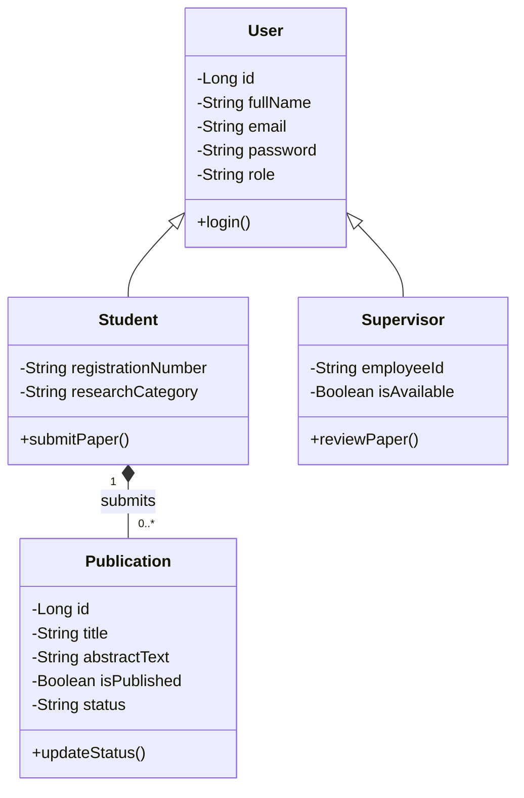
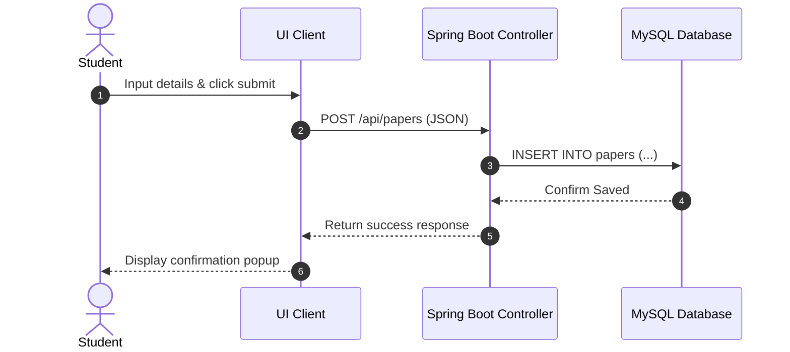
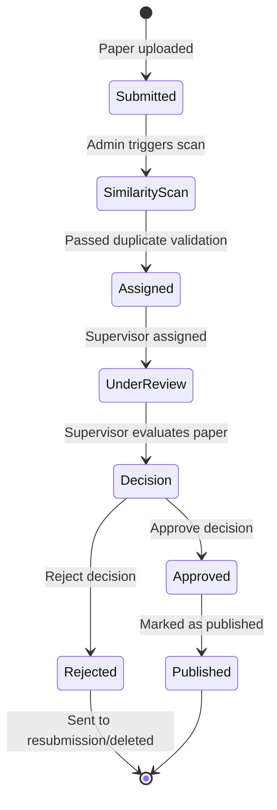

# A Annex: Sample SRS Document

## COVER PAGE
**Project Title:** ResearchSphere – Student Research Publication Repository System  
**Module Code & Module Name:** [Insert Code, e.g., EE-3004] Object-Oriented System Analysis and Design  
**Student Name:** [Insert Student Name]  
**Student Registration Number:** [Insert Registration Number]  
**Academic Year:** 2026/2027  

---

## TABLE OF CONTENTS
- [1. Introduction](#1-introduction)
  - [1.1 Purpose](#11-purpose)
  - [1.2 Scope](#12-scope)
  - [1.3 Definitions, Acronyms, and Abbreviations](#13-definitions-acronyms-and-abbreviations)
  - [1.4 Overview](#14-overview)
- [2. Overall Description](#2-overall-description)
  - [2.1 Product Perspective](#21-product-perspective)
  - [2.2 Product Functions](#22-product-functions)
  - [2.3 User Classes and Characteristics](#23-user-classes-and-characteristics)
  - [2.4 Operating Environment](#24-operating-environment)
  - [2.5 Constraints](#25-constraints)
  - [2.6 Assumptions and Dependencies](#26-assumptions-and-dependencies)
- [3. System Requirements](#3-system-requirements)
  - [3.1 Functional Requirements](#31-functional-requirements)
  - [3.2 Non-Functional Requirements](#32-non-functional-requirements)
- [4. UML Diagrams](#4-uml-diagrams)
  - [4.1 Use Case Diagram](#41-use-case-diagram)
  - [4.2 Class Diagram](#42-class-diagram)
  - [4.3 Sequence Diagram](#43-sequence-diagram)
  - [4.4 Activity Diagram](#44-activity-diagram)
- [5. Future Enhancements](#5-future-enhancements)
- [6. Conclusion](#6-conclusion)
- [7. References](#7-references)

---

# 1. Introduction

## 1.1 Purpose
The purpose of the **ResearchSphere** system is to provide a digital institutional archive that automates, secures, and structures the submission, review, validation, and publication of undergraduate research papers. 

The objective of this Software Requirements Specification (SRS) document is to provide a clear description of the functional requirements, non-functional requirements, operating parameters, and software architecture diagrams. This document acts as the technical guideline for system developers, testers, and academic administrators.

## 1.2 Scope
ResearchSphere is a responsive, standalone, role-based web application tailored for universities.

### What the System Will Do:
- Allow students to register under their academic categories, submit research manuscripts in PDF format, track approval status, and read review comments.
- Enable supervisors to review assigned papers, compare original and revised manuscripts side-by-side, and submit approve/reject choices.
- Allow User Administrators to verify and activate supervisor credentials.
- Allow Repository Administrators to assign supervisors, trigger automated duplicate/plagiarism scans, and manage categories.
- Provide a public repository for all users to search, preview abstracts, and download published manuscripts.

### What the System Will Not Do:
- It will not verify student enrollment records against external third-party registry databases in real time.
- It will not support inline editing of manuscripts (e.g., text editors). All documents are created externally and uploaded in final PDF format.
- It will not host non-academic papers or paid journal subscriptions.

### Benefits:
- Minimizes processing delays in academic departments.
- Ensures academic integrity through duplicate checks.
- Provides search tools for literature reviews.

## 1.3 Definitions, Acronyms, and Abbreviations
- **SRS**: Software Requirements Specification
- **UML**: Unified Modeling Language
- **PDF**: Portable Document Format
- **NIC**: National Identity Card
- **OOP**: Object-Oriented Programming
- **RBAC**: Role-Based Access Control
- **Repository**: Public archive of approved papers.

## 1.4 Overview
This document contains the following sections:
- **Section 2**: Product perspective, functions, user roles, operating parameters, and design constraints.
- **Section 3**: Numbered functional and non-functional requirements.
- **Section 4**: Mermaid UML Use Case, Class, Sequence, and Activity diagrams.
- **Section 5 & 6**: Future enhancements and conclusion.
- **Section 7**: Reference guidelines.

---

# 2. Overall Description

## 2.1 Product Perspective
ResearchSphere is a standalone, client-server web application. The frontend is built as a single-page React application, communicating with a Spring Boot REST API backed by a MySQL database.

## 2.2 Product Functions
- **Student Portal**: Manage profiles, upload papers, track submissions, and view supervisor comments.
- **Supervisor Portal**: Retrieve assigned papers, leave review comments, and approve/reject submissions.
- **User Admin Portal**: Verify and activate supervisor accounts.
- **Repository Admin Portal**: Run duplicate checks, manage categories, and allocate supervisors.
- **Public Repository**: Search, preview abstracts, and download papers.

## 2.3 User Classes and Characteristics
- **Student**: Submits papers and edits drafts. (Basic Web skill level)
- **Supervisor**: Reviews manuscripts and inputs comments. (Academic reviewer skill level)
- **User Admin**: Verifies supervisor accounts. (Administrator skill level)
- **Repository Admin**: Runs similarity checks and allocates papers. (Manager skill level)
- **Super Admin**: Manages system configurations. (IT Expert skill level)

## 2.4 Operating Environment
- **Client Side**: Modern browsers (Chrome, Firefox, Safari, Edge).
- **Application Server**: Spring Boot runtime on Java 17+.
- **Database Server**: MySQL 8.0+.

## 2.5 Constraints
- **Security**: Passwords must be hashed using SHA-256 before storage.
- **File limits**: Document uploads are restricted to PDF formats under 20MB.

## 2.6 Assumptions and Dependencies
- **Assumptions**: Users have access to an internet connection and a web browser.
- **Dependencies**: The system relies on database uptime and mail server availability.

---

# 3. System Requirements

## 3.1 Functional Requirements

### Student Requirements
- **FR-1.1**: The system shall allow a student to register and create an account containing their registered research category.
- **FR-1.2**: The system shall allow a student to submit a publication by entering the title, abstract, keywords, pages, and uploading a PDF manuscript.
- **FR-1.3**: The system shall allow a student to delete rejected papers or drafts.

### Supervisor Requirements
- **FR-2.1**: The system shall allow a supervisor to view their assigned publication queue.
- **FR-2.2**: The system shall allow a supervisor to input comments and approve or reject a publication.

### Administrator Requirements
- **FR-3.1**: The system shall allow Repository Administrators to execute similarity checks on manuscripts.
- **FR-3.2**: The system shall allow Repository Administrators to allocate pending publications to supervisors.
- **FR-3.3**: The system shall allow User Administrators to activate supervisor accounts.

---

## 3.2 Non-Functional Requirements

### Performance Requirements
- **NFR-1.1**: The system shall load search results within 2 seconds.

### Security Requirements
- **NFR-2.1**: Passwords must be hashed using SHA-256, and password input fields must include an interactive show/hide eye icon.

### Usability Requirements
- **NFR-3.1**: The web application layout must be fully responsive across mobile, tablet, and desktop viewports.

### Reliability and Availability Requirements
- **NFR-4.1**: The repository database shall maintain 99.9% uptime during academic cycles.

---

# 4. UML Diagrams

## 4.1 Use Case Diagram

```mermaid
usecaseDiagram
    actor Student
    actor Supervisor
    actor "Repository Admin" as RA

    leftToRightDirection

    Student --> (Submit Publication)
    Student --> (Search & Download)
    Supervisor --> (Review Assigned Paper)
    Supervisor --> (Approve/Reject Paper)
    RA --> (Run Similarity Scan)
    RA --> (Assign Supervisor)
```

### Use Case Description:
- **Submit Publication**: The student uploads a PDF and enters research metadata.
- **Review Assigned Paper**: The supervisor accesses the manuscript and writes comments.
- **Run Similarity Scan**: The Repository Admin checks for duplicates.

---

## 4.2 Class Diagram



### Class Diagram Description:
- **User**: The base entity representing registered accounts.
- **Student / Supervisor**: Inherited child classes with role-specific attributes.
- **Publication**: Represents the research paper. A student submits multiple publications.

---

## 4.3 Sequence Diagram



### Sequence Description:
This diagram shows the student publication submission flow:
1. The student triggers the submission.
2. The React frontend sends the payload to the Spring Boot backend.
3. The server writes the record to the database and returns a confirmation to the frontend.

---

## 4.4 Activity Diagram



### Activity Description:
This diagram maps the lifecycle of an uploaded manuscript, illustrating the progression from submission, similarity scan, supervisor review, and final decision (Approved/Rejected).

---

# 5. Future Enhancements
- **AI recommendation feed**: Recommend relevant research papers to students.
- **Turnitin API Integration**: Integrate Turnitin for automated similarity checks.
- **ORCID sync**: Sync supervisor profiles with international academic databases.

---

# 6. Conclusion
The ResearchSphere repository provides an structured solution to manage, validate, and access student publications. By digitizing research approvals and similarity checks, the platform preserves institutional research while maintaining academic integrity.

---

# 7. References
1. *IEEE Std 830-1998, Software Requirements Specifications*, IEEE Computer Society, 1998.
2. Spring Boot Documentation: https://spring.io/projects/spring-boot
3. React JS Documentation: https://react.dev/
