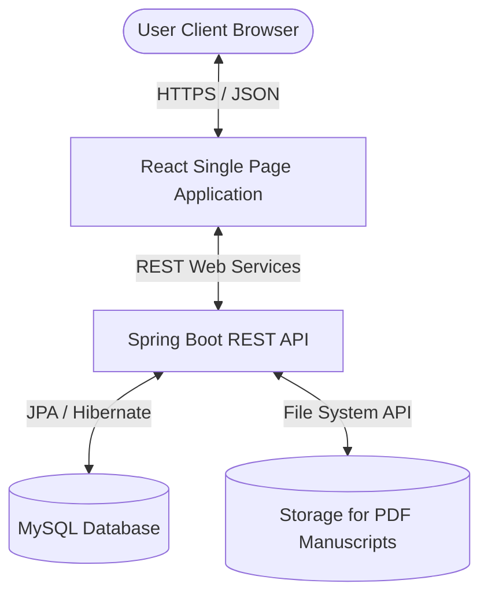
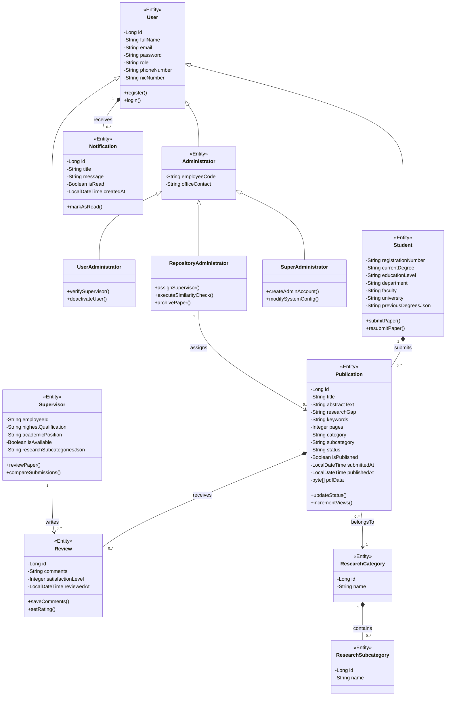
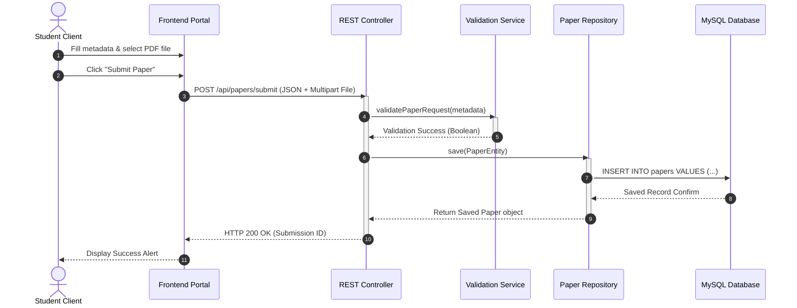
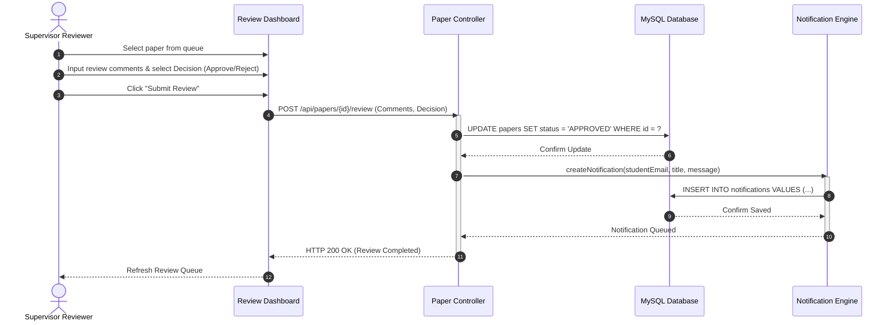
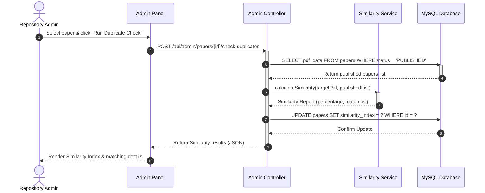
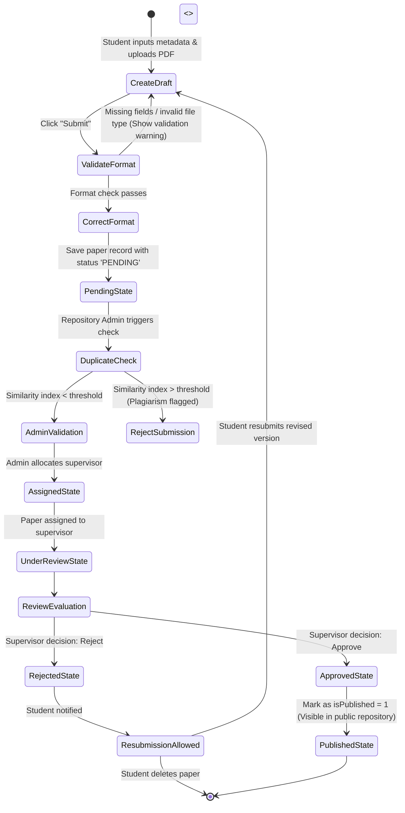

# SOFTWARE REQUIREMENTS SPECIFICATION (SRS)

## ResearchSphere
### Student Research Publication Repository System

**Module Code:** [Insert Module Code, e.g., CS-3002]  
**Module Name:** Object-Oriented Software Engineering and Application Development Project  
**Student Name:** [Insert Student Name]  
**Student Registration Number:** [Insert Registration Number]  
**Academic Year:** 2026/2027  

---

## TABLE OF CONTENTS
- [1. Introduction](#1-introduction)
  - [1.1 Purpose](#11-purpose)
  - [1.2 Scope](#12-scope)
  - [1.3 Definitions, Acronyms, and Abbreviations](#13-definitions-acronyms-and-abbreviations)
  - [1.4 Overview](#14-overview)
- [2. Overall Description](#2-overall-description)
  - [2.1 Product Perspective](#21-product-perspective)
  - [2.2 Product Functions](#22-product-functions)
  - [2.3 User Classes and Characteristics](#23-user-classes-and-characteristics)
  - [2.4 Operating Environment](#24-operating-environment)
  - [2.5 Constraints](#25-constraints)
  - [2.6 Assumptions and Dependencies](#26-assumptions-and-dependencies)
- [3. System Requirements](#3-system-requirements)
  - [3.1 Functional Requirements](#31-functional-requirements)
  - [3.2 Non-Functional Requirements](#32-non-functional-requirements)
- [4. UML Diagrams](#4-uml-diagrams)
  - [4.1 Use Case Diagram](#41-use-case-diagram)
  - [4.2 Class Diagram](#42-class-diagram)
  - [4.3 Sequence Diagrams](#43-sequence-diagrams)
  - [4.4 Activity Diagrams](#44-activity-diagrams)
- [5. Future Enhancements](#5-future-enhancements)
- [6. Conclusion](#6-conclusion)
- [7. References](#7-references)

---

# 1. Introduction

## 1.1 Purpose
This Software Requirements Specification (SRS) document details the functional, non-functional, behavioral, and architectural requirements of **ResearchSphere – Student Research Publication Repository System**. The primary purpose of this system is to serve as an institutional platform for managing, reviewing, validating, and cataloging undergraduate academic research papers. By providing a structured database for student publications, the system aims to promote academic integrity, streamline peer-review and supervisor workflows, and make validated research discoverable to the wider university community.

This SRS is intended to serve as a comprehensive reference guide for software developers, testers, system analysts, and university stakeholders. It establishes a technical agreement on the system's operational boundaries, interfaces, workflows, and quality attributes.

## 1.2 Scope
ResearchSphere is a standalone, responsive, web-based repository system designed to transition paper-based undergraduate thesis submission processes into an automated, role-based digital workflow.

### What the System Will Do:
- Allow students to submit research manuscripts, manage publication details, check submission statuses, and engage in feedback-driven revisions.
- Provide supervisors with dedicated portals to review assigned manuscripts, add constructive feedback, compare original and revised paper versions, and issue final approvals or rejections.
- Empower User Administrators to manage, verify, activate, and deactivate registered supervisor profiles.
- Empower Repository Administrators to configure academic domains, execute duplicate/plagiarism checks, archive publications, and assign reviewers.
- Allow Super Administrators to manage core configuration options, execute comprehensive audits, and manage administrators.
- Host a public repository page where students, supervisors, and authenticated users can search, filter, preview, and download published research documents.

### What the System Will Not Do:
- It will not serve as a general-purpose file hosting service (e.g., Google Drive or Dropbox). It is exclusively restricted to verified PDF research papers.
- It does not contain an inline real-time collaborative text editor (such as Google Docs). Students compile documents externally and upload the final manuscript in PDF format.
- It does not process monetary payments or handle paid journal subscriptions. The repository operates under open-access guidelines within the university intranet.

### Repository Objectives and Publication Workflow:
The system relies on a strictly defined publication pipeline:
1. **Student** registers, fills in profile metadata, and uploads a PDF paper.
2. The **System Validation** engine performs automated schema checks (e.g., required fields, PDF size and limits).
3. The **Repository Administrator** validates the submission and triggers a **Duplicate/Plagiarism Check**.
4. The Repository Administrator assigns the paper to a qualified **Supervisor**.
5. The paper enters the **Under Review** phase.
6. The Supervisor evaluates the paper and either **Approves** or **Rejects** it.
7. Approved papers are **Published** to the public repository; rejected papers are sent back to the student for **Resubmission** or deletion.

### Academic Value and Benefits:
- Establishes a transparent tracking mechanism for students and academic boards.
- Preserves institutional knowledge by digitizing historical student papers.
- Promotes academic integrity through mandatory duplicate check workflows.
- Serves as a search tool for students looking for previous work and literature reviews.

## 1.3 Definitions, Acronyms, and Abbreviations

| Term / Acronym | Definition |
| :--- | :--- |
| **SRS** | Software Requirements Specification; a detailed description of the software system to be developed. |
| **UML** | Unified Modeling Language; standard graphical language for modeling software designs. |
| **PDF** | Portable Document Format; standard format for paper manuscripts. |
| **NIC** | National Identity Card; unique identifier used for authentication and validation. |
| **OOP** | Object-Oriented Programming; programming paradigm based on the concept of "objects" containing data and code. |
| **CRUD** | Create, Read, Update, Delete; the four basic functions of persistent storage. |
| **RBAC** | Role-Based Access Control; restricting system access to authorized users based on their defined role. |
| **GUI** | Graphical User Interface; visual interface elements that allow users to interact with the software. |
| **API** | Application Programming Interface; a set of protocols for building and integrating application software. |
| **Tomcat** | Apache Tomcat; open-source Java Servlet Container used to run Java web applications. |
| **JWT** | JSON Web Token; secure standard for transmitting information between parties as a JSON object. |
| **Repository** | Centralized digital archive where publications are stored and searched. |
| **Publication** | A research paper manuscript that has successfully passed all validation checks and has been published. |
| **Research Category** | Broad academic domains (e.g., Computer Science, Medicine, Statistics). |
| **Research Subcategory** | Specific academic specializations under a category (e.g., Machine Learning, Oncology). |
| **Duplicate Validation** | The process of checking uploaded manuscripts against existing repository files for similarity. |
| **Supervisor** | Academic staff member responsible for reviewing student manuscripts. |
| **Repository Administrator**| Admin responsible for checking duplicates, configuring categories, and assigning supervisors. |
| **User Administrator** | Admin responsible for verifying, activating, and auditing user/supervisor credentials. |
| **Super Administrator** | Master administrator with complete read/write access to system parameters and configs. |

## 1.4 Overview
The remainder of this document is structured as follows:
- **Chapter 2 (Overall Description)**: Outlines the product's perspective, system context, primary functions, user characteristics, development/operating environments, constraints, and dependencies.
- **Chapter 3 (System Requirements)**: Details the formal functional requirements using mandatory "SHALL" statements (structured with preconditions, postconditions, priorities, and actors) and sets out non-functional specifications.
- **Chapter 4 (UML Diagrams)**: Houses detailed Mermaid-based diagrams (Use Case, Class, Sequence, and Activity Diagrams) followed by comprehensive descriptions.
- **Chapter 5 (Future Enhancements)**: Documents prospective system upgrades, including AI integration, third-party hooks, and automatic categorization.
- **Chapter 6 (Conclusion)**: Synthesizes system objectives, architectural values, and benefits.
- **Chapter 7 (References)**: Contains IEEE-format references used throughout the design.

---

# 2. Overall Description

## 2.1 Product Perspective
ResearchSphere is a standalone, web-based digital repository system designed to replace physical thesis collection methods. It operates under a classic Client-Server architecture. The frontend is built using React with modular styling, while the backend is driven by a Spring Boot REST API. The relational database (MySQL) stores paper records, user details, notifications, and review logs.

### System Context Diagram



The system separates concerns cleanly: the user interface is completely decoupled from the business logic layer, allowing either to be updated independently without affecting core operations.

## 2.2 Product Functions
ResearchSphere provides distinct functionalities to five user roles:
- **Student**: Registers using details matched to their university credentials. Students can upload research papers, fill in metadata (title, abstract, research gap, keywords, pages), track status (Pending, Under Review, Approved, Rejected, Published), view review comments, and choose a preferred expert. They can also search and download papers from the public repository.
- **Supervisor**: Reviews assigned manuscripts. Supervisors can add review comments, compare revised submissions with previous versions, and either approve or reject submissions.
- **User Administrator**: Manages supervisor verification workflows. They can activate or deactivate accounts and generate user reports.
- **Repository Administrator**: Manages the publication lifecycle. They check for duplicate papers, assign supervisors, manage academic categories/subcategories, and archive outdated papers.
- **Super Administrator**: Exercises master control over user accounts, system properties, repository parameters, and general application properties.
- **System Functions**: Provides automatic notifications, system validations, view/download counters, and PDF watermarking.

## 2.3 User Classes and Characteristics

| User Role | Main Responsibilities | Skill Level | Permissions |
| :--- | :--- | :--- | :--- |
| **Student** | Submits papers, edits draft papers, reviews comments, searches the repository. | Basic Web user | Create and edit own submissions; download public papers. |
| **Supervisor** | Reviews assigned papers, enters review feedback, approves or rejects submissions. | Proficient | Edit review logs; update statuses of assigned papers. |
| **User Administrator** | Verifies and manages supervisor accounts; generates registration metrics. | Advanced | Write and edit user accounts; read audit logs. |
| **Repository Administrator**| Manages categories, assigns supervisors, reviews plagiarism data, archives papers. | Advanced | Write and edit repository configurations, metadata, and allocations. |
| **Super Administrator** | Oversees all platform elements, edits system configs, manages admin accounts. | Expert | Full access to all CRUD functions and system properties. |

## 2.4 Operating Environment
The system operates under the following environment:
- **Frontend**: React (v18+), running in modern web browsers (Chrome v90+, Firefox v88+, Edge v90+, Safari v14+). Fully responsive layout across desktop, tablet, and mobile displays.
- **Backend Application Server**: Spring Boot (Java 17+), embedded Tomcat Server running on port 8080.
- **Database Engine**: MySQL Relational Database (v8.0+), storing schemas for entities.
- **Manuscript Storage**: Local or cloud file storage system mapped to the backend application to host uploaded PDF manuscripts.

## 2.5 Constraints
- **Technology Constraints**: Developed using Spring Boot and React, which requires the target server to run Java 17+ runtime environments and node execution paths.
- **Security Constraints**: Password credentials must be hashed using SHA-256 before database persistence. All REST communications must use HTTPS protocols.
- **Academic Integrity Constraints**: Submissions must undergo mandatory duplicate checks before supervisor assignment to prevent plagiarism.
- **University Policy Constraints**: Student records must match their registered research category during registration to prevent students from submitting to unrelated domains.

## 2.6 Assumptions and Dependencies
- **Assumptions**: 
  - Users possess access to a device with an internet connection and a modern web browser.
  - Supervisors have active institutional emails to receive review notifications.
- **Dependencies**:
  - The system depends on the availability of a mail server or notification queue to deliver alerts.
  - PDF generation and reading libraries (such as OpenPDF/iText) must compile cleanly.

---

# 3. System Requirements

## 3.1 Functional Requirements

### Student Module Requirements

#### FR-1.1: Submit Research Publication
- **Description**: The system shall allow authenticated students to upload a new research manuscript in PDF format along with the title, abstract, research gap, keywords, page count, subcategory, and optional preferred supervisor.
- **Priority**: High
- **Actor**: Student
- **Preconditions**: Student is authenticated and profile is active.
- **Postconditions**: The publication record is created in the database with status `PENDING`, and a notification is sent to Repository Admins.

#### FR-1.2: Edit Submission within 48 Hours
- **Description**: The system shall allow a student to edit the metadata and manuscript of a submitted paper within 48 hours of initial submission, provided it has not yet been assigned to a supervisor.
- **Priority**: Medium
- **Actor**: Student
- **Preconditions**: The paper's status is `PENDING` and submission time is less than 48 hours ago.
- **Postconditions**: The publication record is updated with new details.

#### FR-1.3: Delete Draft and Rejected Submissions
- **Description**: The system shall allow a student to permanently delete a submission that is saved as a draft or has been officially marked as `REJECTED` by a supervisor.
- **Priority**: High
- **Actor**: Student
- **Preconditions**: The paper's status is `REJECTED` or is a draft.
- **Postconditions**: The paper record and its associated PDF manuscript are permanently removed from the system.

#### FR-1.4: View Supervisor Comments & Satisfaction Rating
- **Description**: The system shall allow the student to view all review comments on their submissions and submit a satisfaction level (1 to 5 stars) upon supervisor review completion.
- **Priority**: Low
- **Actor**: Student
- **Preconditions**: The paper status is `APPROVED` or `REJECTED` and contains supervisor feedback.
- **Postconditions**: The satisfaction rating is saved to the review record.

---

### Supervisor Module Requirements

#### FR-2.1: Review Assigned Manuscript
- **Description**: The system shall present the supervisor with a queue of publications assigned to them for review, enabling them to read the abstract and download/view the manuscript.
- **Priority**: High
- **Actor**: Supervisor
- **Preconditions**: Supervisor is logged in, and has papers assigned.
- **Postconditions**: Supervisor can access the review page for the selected manuscript.

#### FR-2.2: Add Comments and Approve/Reject
- **Description**: The system shall allow the supervisor to enter review comments, select approval/rejection status, and submit their evaluation.
- **Priority**: High
- **Actor**: Supervisor
- **Preconditions**: Supervisor is reviewing an assigned paper in `UNDER REVIEW` status.
- **Postconditions**: Paper status changes to `APPROVED` or `REJECTED`. An automated notification is sent to the student.

#### FR-2.3: Compare Previous and Revised Submissions
- **Description**: The system shall allow the supervisor to view and compare the metadata and manuscript files of the student's revised submission side-by-side with their original submission.
- **Priority**: Medium
- **Actor**: Supervisor
- **Preconditions**: The student has resubmitted a revised version of a previously rejected paper.
- **Postconditions**: The supervisor can view the comparison details.

---

### User Administrator Module Requirements

#### FR-3.1: Verify and Manage Supervisor Accounts
- **Description**: The system shall allow User Administrators to review supervisor registration requests, verify their academic credentials, and toggle their account status between Active and Inactive.
- **Priority**: High
- **Actor**: User Administrator
- **Preconditions**: User Administrator is logged in.
- **Postconditions**: Supervisor status is updated, and the supervisor is notified of their account activation.

---

### Repository Administrator Module Requirements

#### FR-4.1: Perform Duplicate and Plagiarism Check
- **Description**: The system shall allow Repository Administrators to run similarity verification on incoming papers against already published works in the database.
- **Priority**: High
- **Actor**: Repository Administrator
- **Preconditions**: Paper is validated and in `PENDING` state.
- **Postconditions**: A similarity percentage index is generated and attached to the paper's metadata.

#### FR-4.2: Assign Supervisors to Submissions
- **Description**: The system shall suggest and allow the Repository Administrator to allocate a validated paper to a supervisor registered in the same category.
- **Priority**: High
- **Actor**: Repository Administrator
- **Preconditions**: The paper has passed initial validation.
- **Postconditions**: The paper enters the `UNDER REVIEW` state, and the supervisor is notified.

---

### Super Administrator Module Requirements

#### FR-5.1: Manage Administrators and System Configurations
- **Description**: The Super Administrator shall have complete access to create, read, update, and delete admin accounts, configure system variables, and view system logs.
- **Priority**: High
- **Actor**: Super Administrator
- **Preconditions**: Super Admin is authenticated.
- **Postconditions**: System configuration variables are updated globally.

---

### Common System Requirements

#### FR-6.1: Public Repository Search, Preview, and Download
- **Description**: The system shall allow any user to search the repository by title, category, subcategory, and author, preview the paper abstract, and download the manuscript.
- **Priority**: High
- **Actor**: Student, Supervisor, Guest User
- **Preconditions**: The paper's status is `PUBLISHED` (marked as `isPublished` = 1 in the database).
- **Postconditions**: The document view or download counter is incremented by 1.

#### FR-6.2: Password Visibility Toggle
- **Description**: The system shall provide an interactive eye icon next to password input fields to toggle password visibility.
- **Priority**: Medium
- **Actor**: All Users
- **Preconditions**: A password input field is active on the screen.
- **Postconditions**: The password characters toggle between masked characters and plain text.

---

## 3.2 Non-Functional Requirements

### 3.2.1 Performance Requirements
- **Response Time**: The system shall load search results within 2 seconds under a normal load of up to 500 concurrent requests.
- **Throughput**: The backend shall support up to 50 concurrent file upload requests without database timeout.

### 3.2.2 Security Requirements
- **Encryption**: All passwords shall be hashed using SHA-256 before storage.
- **Access Control**: Role-Based Access Control (RBAC) shall block unauthorized cross-role endpoint requests.

### 3.2.3 Reliability and Availability
- **Availability**: The system shall maintain an uptime of 99.9% during academic semesters, excluding scheduled maintenance windows.
- **Fault Tolerance**: Database connection drops shall be handled gracefully with automatic retry configurations.

### 3.2.4 Usability and Accessibility
- **Responsive Layout**: The web interface shall adapt to desktop, tablet, and mobile screens.
- **Contrast**: UI styling shall maintain color contrasts that meet WCAG 2.1 AA accessibility guidelines.

### 3.2.5 Maintainability and Scalability
- **Modularity**: The backend services shall follow Java OOP design principles to ensure code maintainability.
- **Scalability**: The application design shall support scaling the database and file storage independently.

---

# 4. UML Diagrams

## 4.1 Use Case Diagram

```mermaid
usecaseDiagram
    actor Student
    actor Supervisor
    actor "User Admin" as UA
    actor "Repository Admin" as RA
    actor "Super Admin" as SA

    leftToRightDirection

    Student --> (Register & Manage Profile)
    Student --> (Upload & Edit Publications)
    Student --> (Submit Resubmissions)
    Student --> (Search & Download Papers)

    Supervisor --> (Review Assigned Papers)
    Supervisor --> (Submit Approve/Reject Decisions)
    Supervisor --> (Compare Manuscript Versions)

    UA --> (Verify Supervisor Credentials)
    UA --> (Generate User Reports)

    RA --> (Run Similarity Verification)
    RA --> (Allocate Papers to Supervisors)
    RA --> (Manage Research Categories)

    SA --> (Configure System Properties)
    SA --> (Manage Administrative Accounts)
    SA --> (Audit Global System Logs)

    (Upload & Edit Publications) .> (Authentication) : include
    (Review Assigned Papers) .> (Authentication) : include
    (Allocate Papers to Supervisors) .> (Verify Supervisor Credentials) : extend
```

### Use Case Diagram Description
The Use Case Diagram displays system interactions across the five distinct user classes:
1. The **Student** acts as the content creator, managing their profile, submitting papers, and uploading revised drafts.
2. The **Supervisor** acts as the evaluator, retrieving assigned manuscripts, leaving comments, comparing versions, and approving/rejecting submissions.
3. The **User Admin** manages registrations, verifies supervisor credentials, and outputs user registration statistics.
4. The **Repository Admin** manages the repository structure, triggers plagiarism/similarity checks, and allocates papers to supervisors based on domain match.
5. The **Super Admin** acts as the system owner, adjusting application variables, managing administrators, and viewing logs.

---

## 4.2 Class Diagram



### Class Diagram Description
The Class Diagram captures the object-oriented structure of ResearchSphere:
- **User** is the base class containing common attributes. **Student**, **Supervisor**, and **Administrator** inherit from **User**.
- **Administrator** acts as the parent class for **UserAdministrator**, **RepositoryAdministrator**, and **SuperAdministrator**.
- **Student** has a 1-to-many relationship with **Publication**. If a Student is deleted, their draft publications are removed (composition).
- **Publication** holds metadata and the PDF data array. It has a 1-to-many relationship with **Review** elements.
- **Supervisor** writes **Review** evaluations for assigned publications.
- **ResearchCategory** contains multiple **ResearchSubcategory** items, which partition papers into distinct academic domains.

---

## 4.3 Sequence Diagrams

### 1. Student Publication Submission Sequence



#### Sequence Description: Student Publication Submission
This sequence diagram shows the step-by-step submission process:
1. The student selects a PDF file and inputs the required metadata (title, abstract, keywords, pages).
2. Clicking "Submit Paper" fires an HTTP POST request to the REST backend controller.
3. The API invokes validation checks. Once validated, the repository class issues an insert query to the MySQL database.
4. The database confirms persistence, and the controller returns an HTTP 200 OK status to update the frontend.

---

### 2. Publication Review Sequence



#### Sequence Description: Publication Review
This sequence diagram shows how supervisors review and make decisions on papers:
1. The supervisor inputs their comments and selects a decision (Approve/Reject).
2. The frontend POSTs this transaction to the backend controller.
3. The backend updates the publication record status in the database and triggers the Notification Engine to write a notification record for the author.
4. Once completed, the supervisor's dashboard updates to reflect the change.

---

### 3. Duplicate Validation Sequence



#### Sequence Description: Duplicate Validation
This sequence diagram shows the plagiarism detection flow:
1. The Repository Administrator requests a duplicate validation check on a pending paper.
2. The controller retrieves all published manuscripts from the database.
3. The backend compares the content of the target PDF with the stored publications to calculate a similarity index.
4. This value is saved to the paper's record in the database, and the results are returned to the admin panel.

---

## 4.4 Activity Diagrams

### 1. Student Submission Workflow



### Activity Diagram Description
This activity diagram maps the lifecycle of a student paper from draft to final publication:
1. A student uploads their paper, which goes through form validation checks.
2. Once submitted, it enters the `PENDING` state and undergoes similarity checks. If similarity exceeds the institutional threshold, it is rejected.
3. If it passes, a Repository Admin assigns it to a supervisor, putting it in the `UNDER REVIEW` state.
4. The supervisor evaluates the paper. Approved papers are published in the public repository, while rejected papers are sent back to the student for resubmission or deletion.

---

# 5. Future Enhancements
To build upon the core OOP architecture of ResearchSphere, the following enhancements are planned:
1. **AI-Powered Recommendation Engine**: Integrate machine learning models to analyze a student's profile and search history to recommend relevant research papers in their feed ("More From Your Interests").
2. **Automatic Research Categorization**: Implement natural language processing (NLP) to analyze paper abstracts and automatically suggest the most appropriate subcategory.
3. **Turnitin Integration**: Replace the basic internal duplicate check service with an integration to the Turnitin API for comprehensive similarity reports.
4. **ORCID & Google Scholar Integration**: Allow authors and supervisors to link their profiles to ORCID and import citation metrics from Google Scholar.
5. **Digital Object Identifier (DOI) Assignment**: Integrate with Crossref to automatically generate and assign unique DOIs to approved papers upon publication.

---

# 6. Conclusion
ResearchSphere is a robust, responsive digital repository system that transitions undergraduate research management into a secure, role-based web application. The system features:
- Secure authentication.
- Automated file validation.
- Plagiarism checking.
- Structured supervisor review loops.
- A public search interface.

By structuring the backend with Spring Boot and the frontend with React, the platform provides a scalable solution for academic institutions. ResearchSphere helps universities organize, validate, and preserve student research, ensuring academic integrity and making student publications easily discoverable.

---

# 7. References
1. *IEEE Std 830-1998, IEEE Recommended Practice for Software Requirements Specifications*, IEEE Computer Society, 1998.
2. Oracle Corporation, *MySQL Reference Manual*, [Online]. Available: https://dev.mysql.com/doc/
3. Apache Software Foundation, *Apache Tomcat 10 Documentation*, [Online]. Available: https://tomcat.apache.org/tomcat-10.0-doc/index.html
4. Spring Projects, *Spring Framework Reference Documentation*, [Online]. Available: https://docs.spring.io/spring-framework/reference/
5. React Community, *React - A JavaScript library for building user interfaces*, [Online]. Available: https://react.dev/
6. Tailwind CSS Team, *Tailwind CSS Documentation*, [Online]. Available: https://tailwindcss.com/docs
7. Lucide Contributors, *Lucide Icons*, [Online]. Available: https://lucide.dev/
8. Mermaid Team, *Mermaid.js Documentation*, [Online]. Available: https://mermaid.js.org/
9. Google Design, *Material Design Guidelines*, [Online]. Available: https://m3.material.io/
